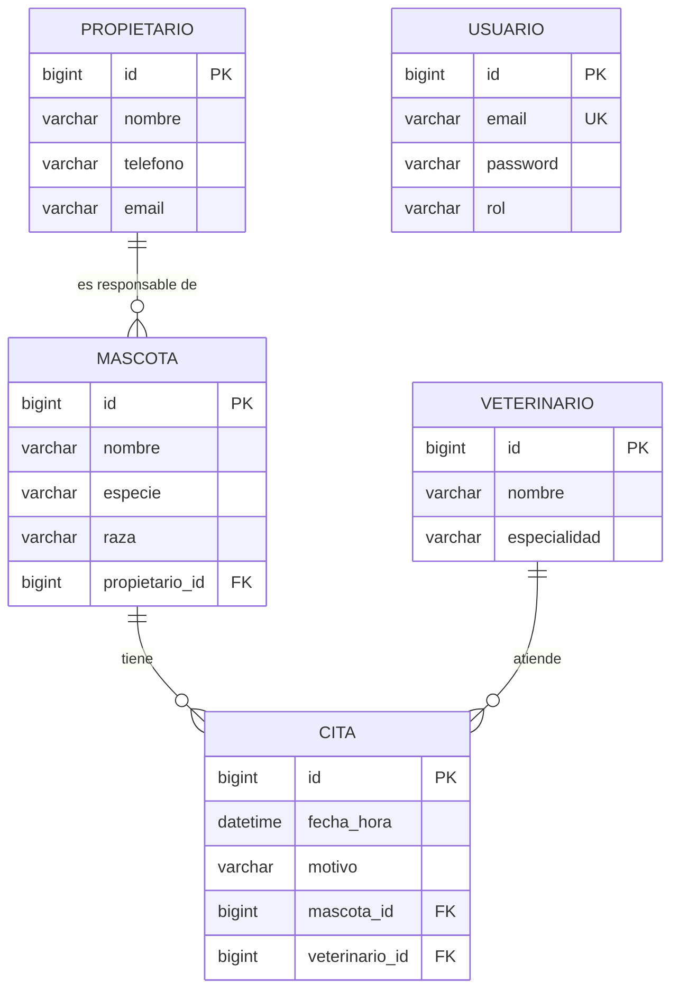
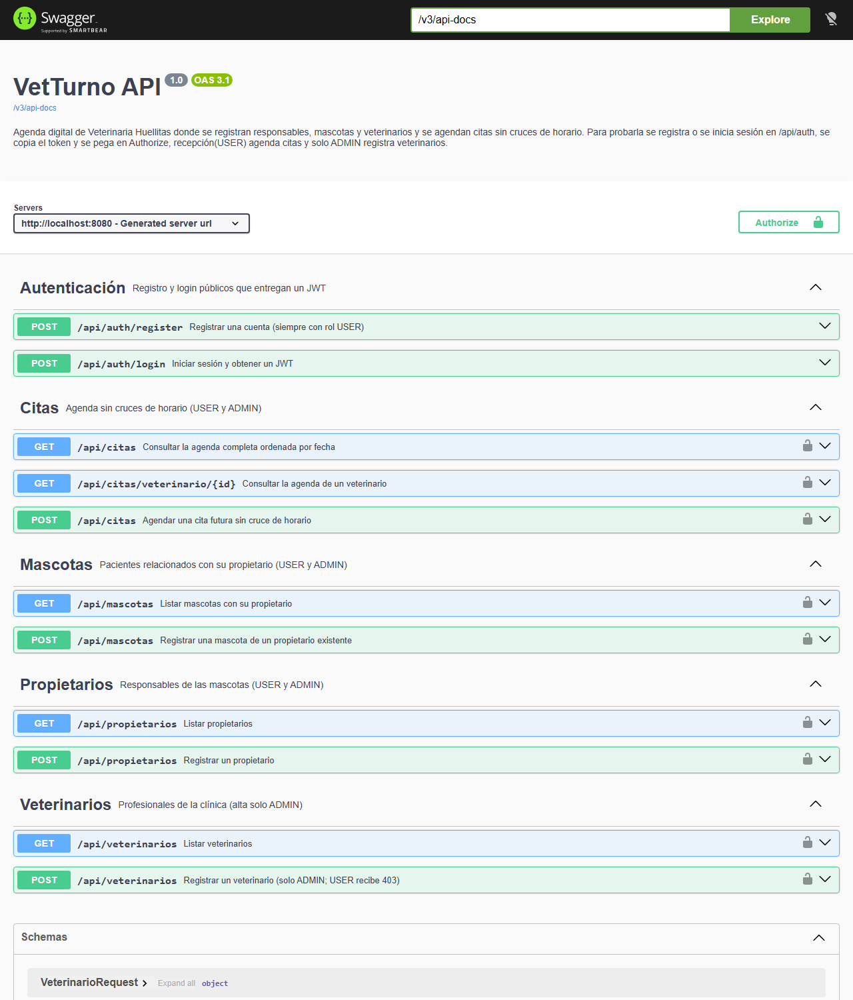

# VetTurno

VetTurno es la agenda digital de **Veterinaria Huellitas**, una API REST donde se registran responsables, mascotas y veterinarios, asimismo se agendan citas sin cruces de horario para poder consultar la agenda de forma clara sin perder información.

## Contenido

1. [Historia](#historia)
2. [Alcance del MVP](#alcance-del-mvp)
3. [Tecnologías](#tecnologías)
4. [Arquitectura por capas](#arquitectura-por-capas)
5. [Modelo de datos](#modelo-de-datos)
6. [Endpoints](#endpoints)
7. [Roles y seguridad](#roles-y-seguridad)
8. [Cómo ejecutar](#cómo-ejecutar)
9. [Probar el flujo en Swagger](#probar-el-flujo-en-swagger)
10. [Errores y códigos HTTP](#errores-y-códigos-http)
11. [Pruebas](#pruebas)
12. [Errores frecuentes](#errores-frecuentes)
13. [Decisiones y explicaciones](#decisiones-y-explicaciones)

## Historia

Veterinaria Huellitas es una clínica de barrio que abrió Doña Marta hace seis años, donde atiende junto al doctor Andrés y a Paula(quien recibe las llamadas, responde los mensajes y organiza las citas). La agenda todavía se lleva entre un cuaderno y conversaciones de WhatsApp, esto provoca que en días con mucho trabajo se reserven dos consultas para el mismo veterinario a la misma hora, se escriba mal el nombre de una mascota o se pierda el teléfono de algún responsable.

El objetivo de VetTurno es poder ordenar la agenda de la veterinaria mediante una API donde la información queda guardada en MySQL, las citas se agendan siempre y cuando la mascota y el veterinario existan, la fecha sea futura y el veterinario no tenga otra cita a esa misma hora.

| Persona | Rol en VetTurno | Qué hace |
|---|---|---|
| Paula, recepcionista | `USER` | Registra responsables y mascotas, agenda citas y consulta la agenda. |
| Doña Marta, administradora | `ADMIN` | Hace lo mismo que recepción y además registra veterinarios. |
| Doctor Andrés, veterinario | (no inicia sesión) | Ve sus citas ordenadas y relacionadas con la mascota correcta. |

## Alcance del MVP

| Incluye | Queda fuera |
|---|---|
| Registro y login con roles USER y ADMIN | Historia clínica, diagnósticos o fórmulas |
| Responsables, mascotas, veterinarios y citas | Pagos, facturación, inventario o tienda |
| Prevención de horarios duplicados por veterinario | Recordatorios por correo o WhatsApp |
| Consulta de citas por veterinario | Interfaz web o aplicación móvil |
| Validación, errores, Swagger, MySQL, README y GitHub | Despliegue en la nube(Docker es opcional) |

## Tecnologías

| Tecnología | Versión | Uso |
|---|---|---|
| Java | 17 | Lenguaje |
| Spring Boot | 4.1.1 | Web MVC, Data JPA, Security, Validation |
| Maven | Wrapper incluido (`mvnw`) | Dependencias y construcción |
| MySQL | 8.x | Persistencia |
| Hibernate / JPA | La que trae Spring Boot | Mapeo objeto-relacional |
| jjwt | 0.13.0 | Generar y validar JWT |
| springdoc-openapi | 3.1.0 | OpenAPI y Swagger UI |
| JUnit 5 + Mockito | La que trae Spring Boot | Pruebas unitarias |

## Arquitectura por capas

Todo el código está dentro del paquete base `com.huellitas.vetturno` y se separa por capas, donde cada paquete tiene una sola responsabilidad:

```text
src/main/java/com/huellitas/vetturno
├── VetTurnoApplication.java   Punto de entrada que inicia y autoconfigura Spring Boot
├── controller/                Recibe la petición HTTP y delega a los servicios
├── service/                   Reglas del negocio(sin detalles de HTTP)
├── repository/                Acceso a MySQL mediante Spring Data JPA
├── model/                     Entidades JPA(lo que se guarda)
├── dto/                       Datos de entrada(Request) y de salida(DTO)
├── security/                  JWT, filtro, carga del usuario y SecurityConfig
├── config/                    OpenAPI y reloj de la aplicación
└── exception/                 ApiError, excepción de negocio y manejador global
```

Cuando llega un `POST /api/citas` primero `JwtAuthFilter` lee el token para poner al usuario en la petición, después `SecurityConfig` revisa que tenga rol USER o ADMIN. `CitaController` recibe el JSON mientras `@Valid` revisa `CitaRequest`, luego `CitaService` busca la mascota y el veterinario, revisa que la fecha sea futura, revisa que el horario esté libre, `CitaRepository` guarda la cita en MySQL, al final el controller responde `201 Created` con un `CitaDTO` plano.

Todas las dependencias se inyectan por constructor(campos `private final`), no se usa `new` para los componentes ni `@Autowired` en campos.

## Modelo de datos



| Entidad | Reglas |
|---|---|
| Propietario | Nombre y teléfono obligatorios, el email es opcional pero debe ser válido y puede tener varias mascotas. |
| Mascota | Nombre, especie y propietario obligatorios, pertenece a un solo propietario(`@ManyToOne`). |
| Veterinario | Nombre y especialidad obligatorios, solo ADMIN puede registrarlo. |
| Cita | Fecha futura y motivo obligatorio, la mascota y el veterinario deben existir, la tabla tiene una restricción única `(veterinario_id, fecha_hora)`. |
| Usuario | Email único, contraseña con BCrypt y rol `USER` o `ADMIN` guardado como texto. |

Las llaves foráneas quedan en el lado muchos de cada relación(`mascota.propietario_id`, `cita.mascota_id` y `cita.veterinario_id`), las relaciones son unidireccionales y la explicación está en [Decisiones y explicaciones](#decisiones-y-explicaciones). El SQL que genera Hibernate junto con las consultas al esquema están en [docs/evidencias/esquema-mysql.md](docs/evidencias/esquema-mysql.md).

## Endpoints

| Método | Ruta | Acceso | Resultado esperado |
|---|---|---|---|
| POST | `/api/auth/register` | Público | Registra un USER y devuelve un token (200). |
| POST | `/api/auth/login` | Público | Revisa las credenciales y devuelve un JWT (200). |
| POST | `/api/propietarios` | USER / ADMIN | Crea un responsable (201). |
| GET | `/api/propietarios` | USER / ADMIN | Lista los responsables (200). |
| POST | `/api/mascotas` | USER / ADMIN | Crea una mascota de un propietario que ya existe (201). |
| GET | `/api/mascotas` | USER / ADMIN | Lista las mascotas con el id y nombre de su propietario (200). |
| POST | `/api/veterinarios` | ADMIN | Crea un veterinario (201), USER recibe 403. |
| GET | `/api/veterinarios` | USER / ADMIN | Lista los veterinarios (200). |
| POST | `/api/citas` | USER / ADMIN | Agenda una cita válida y sin cruce (201). |
| GET | `/api/citas` | USER / ADMIN | Agenda completa ordenada por fecha (200). |
| GET | `/api/citas/veterinario/{id}` | USER / ADMIN | Citas de un veterinario ordenadas por fecha (200). |

### Contratos de entrada y salida

| DTO | Dirección | Campos |
|---|---|---|
| `RegistroRequest` | Entrada | `email`, `password` (8 a 72 caracteres) |
| `LoginRequest` | Entrada | `email`, `password` |
| `AuthResponse` | Salida | `token` |
| `PropietarioRequest` / `PropietarioDTO` | Entrada / salida | `nombre`, `telefono`, `email`, la salida incluye `id` |
| `MascotaRequest` | Entrada | `nombre`, `especie`, `raza`, `propietarioId` |
| `MascotaDTO` | Salida | `id`, `nombre`, `especie`, `raza`, `propietarioId`, `propietarioNombre` |
| `VeterinarioRequest` / `VeterinarioDTO` | Entrada / salida | `nombre`, `especialidad`, la salida incluye `id` |
| `CitaRequest` | Entrada | `fechaHora` (`yyyy-MM-ddTHH:mm`), `motivo`, `mascotaId`, `veterinarioId` |
| `CitaDTO` | Salida | `id`, `fechaHora`, `motivo`, `mascotaId`, `mascota`, `propietario`, `veterinarioId`, `veterinario` |
| `ApiError` | Error | `status`, `mensaje`, `errores` (por campo), `timestamp` |

Ejemplo de `CitaDTO`:

```json
{
  "id": 1,
  "fechaHora": "2026-10-01T10:00:00",
  "motivo": "Vacunación anual",
  "mascotaId": 1,
  "mascota": "Firulais",
  "propietario": "Laura Gómez",
  "veterinarioId": 1,
  "veterinario": "Andrés Ruiz"
}
```

## Roles y seguridad

El registro y el login son públicos, todo lo demás en `/api/**` pide un JWT válido. El registro siempre asigna `USER` aunque el cliente mande `"rol": "ADMIN"`(el DTO no tiene campo `rol`), solo `ADMIN` puede registrar veterinarios mientras que consultarlos es trabajo de recepción(USER y ADMIN).

Las contraseñas se guardan con **BCrypt**, nunca se regresan ni se guardan en texto plano. El JWT se manda como `Authorization: Bearer <token>`, va firmado con la clave de `jwt.secret` y **se vence** en 1 hora por defecto(`jwt.expiration-ms`). La API es **stateless**, no se guarda sesión en el servidor, cada petición protegida lleva su propio token.

Swagger(`/swagger-ui.html` y `/v3/api-docs`) se dejó público porque solo muestra la documentación, los endpoints del negocio siguen protegidos.

### Habilitar el primer ADMIN (Doña Marta)

El registro público nunca crea administradores, por eso el primer ADMIN se habilita directamente en la base:

1. Se registra la cuenta con `POST /api/auth/register`(queda como USER).
2. En MySQL Workbench se ejecuta:

   ```sql
   UPDATE usuario SET rol = 'ADMIN' WHERE email = 'marta@huellitas.com';
   ```

3. Se inicia sesión de nuevo con `POST /api/auth/login` y se usa el token nuevo.

## Cómo ejecutar

### Requisitos

Se necesita JDK 17 o superior(`java -version`) y MySQL 8 corriendo, no hace falta instalar Maven porque el proyecto trae el wrapper `mvnw`.

### Pasos

1. Clonar el repositorio:

   ```bash
   git clone https://github.com/arturolopezsimental81-glitch/taller_m3.git
   cd taller_m3
   ```

2. Crear la base de datos vacía en MySQL:

   ```sql
   CREATE DATABASE vetturno;
   ```

3. Copiar `src/main/resources/application-local.properties.example` como `src/main/resources/application-local.properties` y completar los datos:

   ```properties
   spring.datasource.url=jdbc:mysql://localhost:3306/vetturno
   spring.datasource.username=TU_USUARIO
   spring.datasource.password=TU_PASSWORD
   jwt.secret=UNA_CLAVE_ALEATORIA_DE_32_O_MAS_CARACTERES
   ```

   La clave se puede generar con `openssl rand -base64 48`, el archivo `application-local.properties` está en `.gitignore` y las credenciales nunca se suben al repositorio. También se pueden usar las variables de entorno `DB_URL`, `DB_USER`, `DB_PASSWORD` y `JWT_SECRET`.

4. Iniciar la aplicación:

   ```bash
   .\mvnw.cmd spring-boot:run    # Windows
   ./mvnw spring-boot:run        # macOS / Linux
   ```

5. Abrir Swagger UI en <http://localhost:8080/swagger-ui.html>.

Hibernate crea las tablas al iniciar(`spring.jpa.hibernate.ddl-auto=update`) y muestra el SQL en la consola.

### Empaquetar

```bash
.\mvnw.cmd clean package      # Windows, compila, corre las pruebas y genera el JAR
./mvnw clean package          # macOS / Linux
java -jar target/vetturno-0.0.1-SNAPSHOT.jar
```

## Probar el flujo en Swagger



*Captura de Swagger UI donde se ve el título VetTurno API, la descripción de Veterinaria Huellitas, el botón Authorize y los 11 endpoints agrupados en Autenticación, Citas, Mascotas, Propietarios y Veterinarios.*

Los datos se crean desde la API y no desde Workbench, el orden que se siguió fue el siguiente:

1. **Registrar a Paula** con `POST /api/auth/register` y `{"email": "paula@huellitas.com", "password": "Recepcion2026"}`.
2. **Registrar a Doña Marta** con otro email y pasarla a ADMIN con el `UPDATE` de la sección anterior.
3. **Login de Marta** con `POST /api/auth/login` y copiar el valor de `token`.
4. Dar clic en **Authorize**, pegar el token(sin la palabra Bearer) y confirmar.
5. `POST /api/veterinarios` con `{"nombre": "Andrés Ruiz", "especialidad": "Medicina general"}` responde 201.
6. Cerrar la autorización e iniciar sesión como Paula, y con su token:
   - `POST /api/veterinarios` responde **403** porque USER no registra veterinarios.
   - `POST /api/propietarios` con `{"nombre": "Laura Gómez", "telefono": "618 123 4567", "email": "laura@correo.com"}` responde 201.
   - `POST /api/mascotas` con `{"nombre": "Firulais", "especie": "Perro", "raza": "Criollo", "propietarioId": 1}` responde 201.
   - `POST /api/citas` con `{"fechaHora": "2026-12-01T10:00", "motivo": "Vacunación anual", "mascotaId": 1, "veterinarioId": 1}` responde 201(la fecha tiene que ser futura).
   - Repetir la misma cita responde **400** porque el veterinario ya tiene una cita en ese horario.
   - `GET /api/citas/veterinario/1` regresa la agenda del doctor Andrés.
7. Reiniciar la aplicación, iniciar sesión otra vez y consultar `GET /api/citas`, las citas siguen guardadas.

## Errores y códigos HTTP

Todos los errores responden con el mismo formato `ApiError`:

```json
{
  "status": 400,
  "mensaje": "Los datos enviados no son válidos",
  "errores": {
    "email": "El email no tiene un formato válido",
    "nombre": "El nombre es obligatorio",
    "telefono": "El teléfono debe tener entre 7 y 20 dígitos y puede iniciar con +"
  },
  "timestamp": "2026-09-24T18:10:12.345"
}
```

| Código | Cuándo |
|---|---|
| 200 OK | Consultas, registro y login correctos. |
| 201 Created | Creación de propietario, mascota, veterinario o cita. |
| 400 Bad Request | Datos inválidos, JSON mal escrito, referencia que no existe, fecha pasada o cita cruzada. |
| 401 Unauthorized | Sin token, token inválido o vencido, o credenciales incorrectas en el login. |
| 403 Forbidden | Sí inició sesión pero el rol no alcanza(USER registrando veterinarios). |
| 404 Not Found | La ruta no existe. |
| 500 Internal Server Error | Falla que no se esperaba, se responde un mensaje genérico y el detalle solo queda en el log del servidor. |

Las reglas de formato están en los DTO de entrada(Bean Validation con `@Valid`), mientras que las reglas de la agenda(fecha futura, horario libre y referencias que existan) están en `CitaService`.

## Pruebas

### Matriz de pruebas manuales

La matriz se corrió contra la API real con MySQL empezando con la base vacía, el detalle de cada petición y respuesta(con los tokens ocultos) está en [docs/evidencias/matriz-resultados.md](docs/evidencias/matriz-resultados.md).

| # | Escenario | Resultado esperado | Estado HTTP obtenido | Resultado |
|---|---|---|---|---|
| 1 | La aplicación inicia con MySQL disponible. | Servidor activo y esquema accesible. | 200 | Aprobada |
| 2 | Registro válido de Paula. | 200 y token; contraseña hasheada. | 200 | Aprobada |
| 3 | Registro con email inválido y clave corta. | 400 con errores por campo. | 400 | Aprobada |
| 4 | Login con credenciales válidas. | 200 y JWT vigente. | 200 | Aprobada |
| 5 | GET /api/citas sin token. | Acceso rechazado. | 401 | Aprobada |
| 6 | POST /api/veterinarios con USER. | 403 Forbidden. | 403 | Aprobada |
| 7 | POST /api/veterinarios con ADMIN. | 201 y veterinario persistido. | 201 | Aprobada |
| 8 | Creación válida de propietario. | 201 y DTO sin colecciones anidadas. | 201 | Aprobada |
| 9 | Creación de mascota con propietario existente. | 201 y relación correcta. | 201 | Aprobada |
| 10 | Mascota con propietario inexistente. | 400 controlado; no se inserta fila. | 400 | Aprobada |
| 11 | Cita futura con referencias válidas. | 201 y cita persistida. | 201 | Aprobada |
| 12 | Cita con fecha pasada. | 400 con mensaje claro. | 400 | Aprobada |
| 13 | Segundo intento con mismo veterinario y horario. | 400; se conserva una sola cita. | 400 | Aprobada |
| 14 | Filtro de citas por veterinario. | 200 y solo coincidencias. | 200 | Aprobada |
| 15 | Reinicio y prueba desde Swagger con Authorize. | Datos persisten y flujo protegido funciona. | 200 | Aprobada |

Resultado: 15 de 15 pruebas aprobadas.

### Pruebas unitarias

Con `./mvnw test` se corren las pruebas de JUnit 5 y Mockito, estas pruebas no necesitan MySQL:

| Clase de prueba | Qué revisa |
|---|---|
| `CitaServiceTest` | Cita válida, fecha pasada, fecha igual a la hora actual, horario ocupado, mascota o veterinario que no existe y filtro por veterinario. |
| `AuthServiceTest` | Registro con rol USER y hash BCrypt, email repetido, login válido e inválido. |
| `JwtServiceTest` | Token válido, vencido, firmado con otra clave, texto que no es token y largo mínimo de la clave. |
| `GlobalExceptionHandlerTest` | 500 sin detalles internos, 400 de negocio, 401 y 403. |

## Errores frecuentes

| Síntoma | Causa probable | Solución |
|---|---|---|
| `Could not resolve placeholder 'JWT_SECRET'` al iniciar | No existe `application-local.properties` ni la variable `JWT_SECRET`. | Crear el archivo local a partir del `.example` o definir la variable. |
| `jwt.secret debe tener al menos 32 caracteres` | La clave es muy corta(o se dejó el valor de ejemplo). | Usar una clave aleatoria de 32 caracteres o más. |
| `Access denied for user` o `Communications link failure` | Usuario, contraseña o URL de MySQL incorrectos, o MySQL apagado. | Revisar `spring.datasource.*` y que MySQL esté corriendo. |
| `Unknown database 'vetturno'` | La base no existe. | Ejecutar `CREATE DATABASE vetturno;`. |
| 401 en todos los endpoints | Falta el token, ya se venció o se pegó con la palabra Bearer en Swagger. | Iniciar sesión de nuevo y pegar solo el token en Authorize. |
| 403 al registrar un veterinario | La cuenta es USER. | Pasar la cuenta a ADMIN con el `UPDATE` y volver a iniciar sesión. |
| 400 "El cuerpo de la petición no es un JSON válido" | JSON mal escrito o fecha con otro formato. | Usar comillas dobles y `fechaHora` como `2026-12-01T10:00`. |
| `Port 8080 was already in use` | Hay otra instancia abierta. | Detener la otra instancia o cambiar `server.port`. |

## Decisiones y explicaciones

**pom.xml y la clase principal.** El `pom.xml` declara los datos del proyecto, la versión de Java, las dependencias y cómo se construye con Maven, mientras que `VetTurnoApplication` es código donde su `main` arranca Spring Boot, que revisa el paquete base, configura el servidor embebido y crea los componentes.

**pom.xml y application.properties.** El `pom.xml` decide qué librerías tiene el proyecto, mientras que `application.properties` configura cómo se comportan al ejecutarse(conexión a MySQL, Hibernate y JWT).

**JPA, Hibernate y JpaRepository.** JPA es la especificación(las anotaciones como `@Entity` o `@ManyToOne`), Hibernate es la implementación que genera y ejecuta el SQL, `JpaRepository` es la parte de Spring Data que da `save`, `findAll` y `findById`, asimismo arma consultas derivadas a partir del nombre del método como `existsByVeterinarioIdAndFechaHora`.

**Relaciones unidireccionales.** Las relaciones se hicieron unidireccionales(solo con `@ManyToOne`), la mascota apunta a su propietario, la cita apunta a su mascota y a su veterinario. No se agregó `@OneToMany` de regreso porque ningún endpoint necesita recorrer las mascotas de un propietario desde la entidad, así se evita la recursión JSON(propietario, mascotas, propietario otra vez) junto con la carga de colecciones que no se usan.

**DTO en lugar de entidades.** `MascotaDTO` muestra solo el id y el nombre del propietario, si se regresara la entidad `Mascota` se expondría la estructura interna, se podrían disparar cargas perezosas fuera de la transacción, con relaciones de ida y vuelta se generarían ciclos en el JSON.

**Reglas de la agenda en el servicio.** La fecha futura y el horario libre son reglas del negocio, no del formato HTTP, por eso están en `CitaService`. `@Future` en `CitaRequest` da un aviso antes, asimismo la restricción única de la tabla `cita` cubre el caso de dos peticiones al mismo tiempo. La agenda trabaja por minutos, `10:00:30` se guarda como `10:00`.

**El manejador global no reemplaza la seguridad.** `SecurityConfig` decide quién puede hacer qué antes de que la petición llegue a un controller, mientras que `GlobalExceptionHandler` solo le da formato a los errores. Por eso los rechazos 401 y 403 de los filtros se mandan al manejador, la decisión sigue siendo de la seguridad pero el formato queda igual en toda la API.

**CSRF desactivado.** La API no usa cookies ni sesión y el token viaja en un encabezado que el navegador no manda solo, por eso con autenticación Bearer stateless CSRF no aplica.

**Secretos fuera del código.** La clave JWT y la contraseña de MySQL se leen de `application-local.properties`(que está en `.gitignore`) o de variables de entorno, la aplicación solo arranca siempre y cuando tenga una clave JWT de al menos 32 caracteres.

**Mejora futura.** Recordatorios por WhatsApp un día antes de la cita para que falten menos pacientes, esto se quedó fuera del MVP porque depende de un servicio externo y primero se tenía que ordenar la agenda.

Las respuestas a las preguntas para pensar del taller están en [docs/preguntas-para-pensar.md](docs/preguntas-para-pensar.md).
